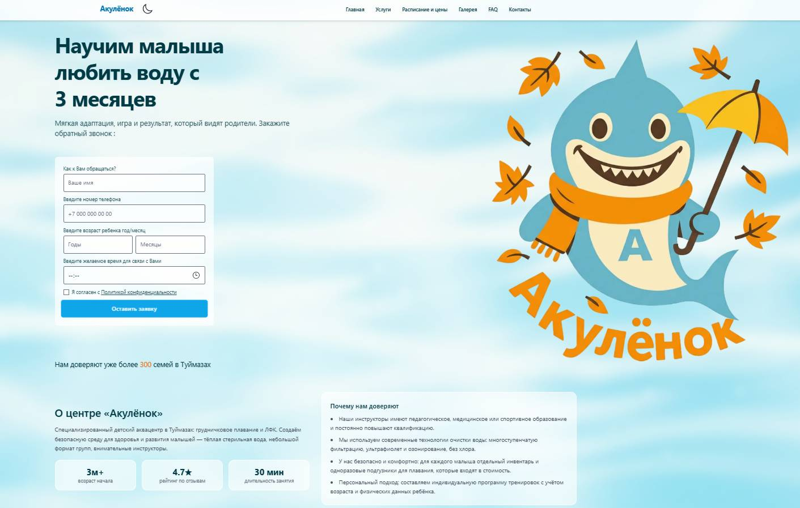

# LidFlow

Современный лендинг и конструктор блоков на **Next.js 15**, **React 19** и **TypeScript**. Проект показывает маркетинговую страницу с Galaxy-фоном и визуальный дизайнер секций. Код оптимизирован под деплой на Vercel, строгую типизацию и подключение аналитики.

## Стек

- Next.js 15.5 (app router, edge-функции)
- React 19 + TypeScript с включённым `strict`, `noImplicitAny`, `noUncheckedIndexedAccess`
- Tailwind CSS 3.4, собственные токены и кастомные эффекты (glow, spotlight)
- Zod для валидации форм, Telegram Bot API для заявок
- @vercel/analytics для базовой аналитики, возможна интеграция GA4/YM через env

## Запуск локально

```bash
npm install
npm run dev
```

Сайт появится на `http://localhost:3000`. Перед коммитом проверьте качество кода:

```bash
npm run lint
npm run build
```

## Переменные окружения

Создайте `.env.local` и заполните:

```bash
TG_BOT_TOKEN=ваш_токен_бота
TG_CHAT_ID=целевой_chat_id
NEXT_PUBLIC_SITE_URL=https://ваш-домен.vercel.app
```

Без токенов API `/api/telegram` возвращает ошибку 500 и не отправляет сообщения — это помогает избежать ложных срабатываний.

## Деплой на Vercel

1. Импортируйте репозиторий в Vercel.
2. Укажите `NEXT_PUBLIC_SITE_URL`, `TG_BOT_TOKEN`, `TG_CHAT_ID` в настройках проекта.
3. Build command: `next build`, output: `.next` (значения по умолчанию).
4. Запустите деплой — билд пройдёт без дополнительных настроек.

## Структура

- `app/page.tsx` — маркетинговая главная с Galaxy-фоном.
- `app/designer/page.tsx` — клиентский конструктор блоков.
- `app/api/telegram/route.ts` — edge-функция, отправка заявок в Telegram.
- `components/ui/Galaxy.tsx` — WebGL-анимация с поддержкой `prefers-reduced-motion`.
- `components/ContactForm.tsx` — клиентская форма с валидацией через Zod.
- `app/robots.ts`, `app/sitemap.ts` — статические SEO-маршруты.

## Скриншоты



## Контакты

- Telegram: [@your_username](https://t.me/your_username)
- Email: hello@lidflow.site

Если заметили баг или хотите доработку — создайте issue или напишите напрямую.